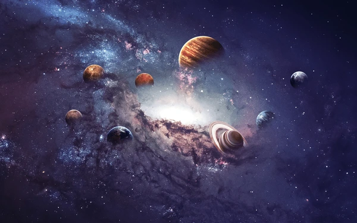
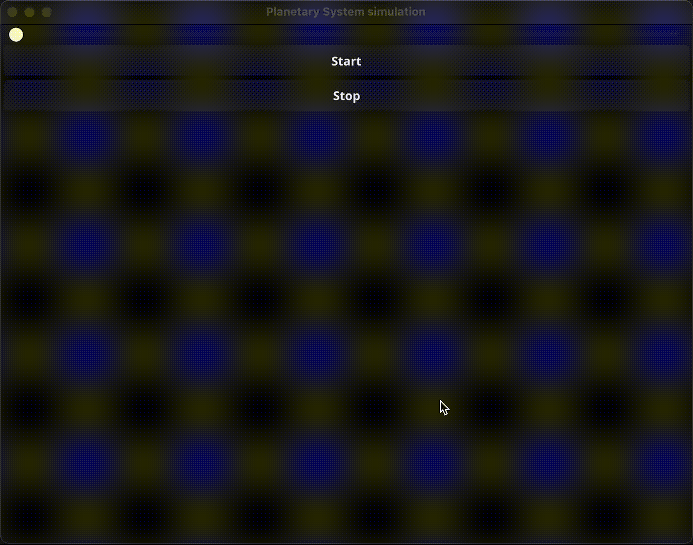

# Planetary System simulation
This is a simple planetary system simulation writing in Golang and uses the `github.com/fyne.io/fyne/v2` library for visualization. 

You have to choose the number of planets. Star is always in the center of the system.
The planets are moving around the star. The speed, colour and radius of the planets is random.



## Run
To run the project, you need to have the `fyne` library installed.
You can install it by running the following command:
```bash
go get fyne.io/fyne/v2
```
Then you can run the project by running the following command:
```bash
go run main.go
```

## TODO:
- [ ] The rotation of a planet should not overlap another planet.
- [ ] Add a button stop to return to the main menu. If the user clicks on the button, the simulation should stop and the main menu should appear. If the user doesn't change the number of planets, the simulation should continue from the last state.
- [ ] Add a random number of satellite planets are created for each planet, smaller than the planet itself, and of a random color.
- [ ] Add a mass to the planets and calculate the gravitational force between the planets.
- [ ] Add a radius to the planet and calculate the collision between the planets. Next planet should be.

